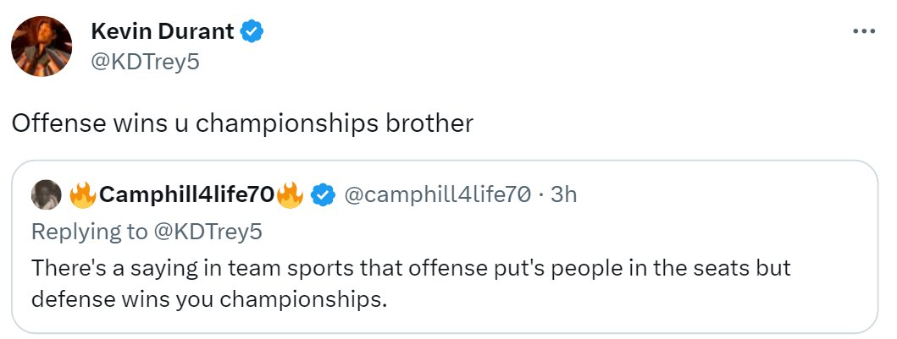
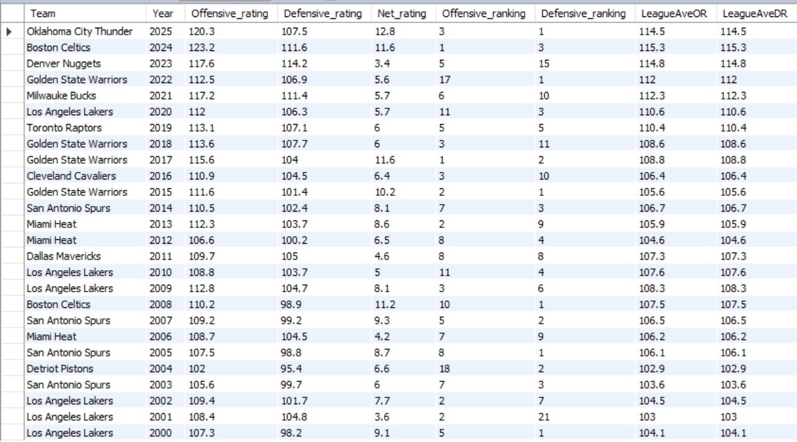
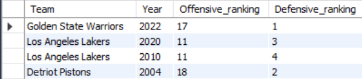

# 🏀 Do Offense or Defense Win NBA Championships?

Inspired by the playoff season and a tweet from one of the best offensive players, Kevin Durant:


*Kevin Durant: “Offense wins championships”*

This project analyzes the last 25 NBA champions to determine whether offense or defense plays a bigger role in winning a championship.

---

## 🛠️ Tools Used
- Excel (data collection)
- MySQL (data analysis)
- Tableau (visualization)

---

## 🔗 Links
- 📊 Dataset: [NBA Champions Dataset](nba_champions_rating.csv)
- 💻 SQL Queries: [NBA Champions Query](champions_ranking_query.sql)
- 📈 Tableau Dashboard: 

---

## 🧠 Methodology
- Collected data from the last 25 NBA champions
- Included:
  - Offensive Rating / Ranking
  - Defensive Rating / Ranking
  - Net Rating
- Classified teams as:
  - Offense-led
  - Defense-led
- Compared rankings, top 10 presence, and performance gaps

---

## 🔥 Key Findings

- 13 out of 25 champions were defense-led
- No team won a championship while being outside the top 10 in both offense and defense
- 3 teams won with elite offense but outside top 10 defense
- 4 teams won with elite defense but outside top 10 offense
- Defense-led teams were slightly more consistent than offense-led teams

---

## 📊 Data Overview

```sql
SELECT *
FROM nba_champions_rating;
```


At a glance, championship teams are rarely average. They are typically elite in at least one category and most of the time strong in both ends of the floor.

---

## ❓ Can a team win without being top 10 in both?

```sql
SELECT Team, Year
FROM nba_champions_rating
WHERE Offensive_ranking > 10 
AND Defensive_ranking > 10;
```


**Result**: None

No team in the last 25 years has won a championship while being outside the top 10 in both offense and defense.

---

## 📊 Champions Top 10 in One Category

- **Defense Top 10**
```sql
SELECT Team, Year, Offensive_ranking, Defensive_ranking
FROM nba_champions_rating
WHERE Offensive_ranking > 10;
```



- **Offense Top 10**
```sql
SELECT Team, Year, Offensive_ranking, Defensive_ranking
FROM nba_champions_rating
WHERE Defensive_ranking > 10;
```


**Result**:
- 3 teams won with elite offense but below-average defense
- 4 teams won with elite defense but below-average offense

Both styles can win, but defensive teams have won slightly more.

---

## 🤔 How many championship teams are led in offense vs defense?
```sql
SELECT 
    SUM(CASE WHEN Offensive_ranking < Defensive_ranking THEN 1 ELSE 0 END) AS off_led,
    SUM(CASE WHEN Defensive_ranking < Offensive_ranking THEN 1 ELSE 0 END) AS def_led,
    SUM(CASE WHEN Defensive_ranking = Offensive_ranking THEN 1 ELSE 0 END) AS tie
FROM nba_champions_rating;
```


**Result**:
- 13 defense-led champions
- 11 offense-led champions
- 2 tie

Defense holds a slight edge, winning two more championships than offense-led teams.

---

## 📊 The gap of offensive and defensive team compare to their other end of the floor

```sql
SELECT 
    ROUND(AVG(CASE 
        WHEN Offensive_ranking < Defensive_ranking 
        THEN Defensive_ranking - Offensive_ranking 
    END), 2) AS avg_off_gap,

    ROUND(AVG(CASE 
        WHEN Defensive_ranking < Offensive_ranking 
        THEN Offensive_ranking - Defensive_ranking 
    END), 2) AS avg_def_gap

FROM nba_champions_rating;
```


**Result**:
- 6.18 for the gap for offensive led team
- 6.54 for the gap for defensive led team


Both results are the almost the same, meaning that there is a certain balance between the two even if their other category is better.

---

## 📊 Net Rating Comparison
```sql
SELECT 
    ROUND(AVG(CASE WHEN Offensive_ranking < Defensive_ranking THEN Net_rating END), 2) AS avg_net_off_led,
    ROUND(AVG(CASE WHEN Defensive_ranking < Offensive_ranking THEN Net_rating END), 2) AS avg_net_def_led,
    ROUND(AVG(CASE WHEN Defensive_ranking = Offensive_ranking THEN Net_rating END), 2) AS avg_net_tie
FROM nba_champions_rating;
```


**Result**:
- 6.99 is the average net rating for offensive led team
- 8.06 is the average net rating for defensive led team
- 5.3 is the average net rating for teams that have the same rating for their defense and offense.

We can see here that all championship teams have a +5 net rating. But the most dominant team in the regular season is defensive led team. 

---

## 🎯 Conclusion
While Kevin Durant claims that offense wins championships, the data tells a more balanced story.

Defensive led teams have been slightly more successful over the past 25 years, winning 13 out of 25 championships. They also tend to have higher net ratings, indicating stronger overall dominance during the regular season.

However, both offensive led and defensive led teams can win, as long as they are elite in at least one area.

The key takeaway here is that championship teams are rarely average, they are elite on at least one side of the ball, and more often than not, that edge comes from defense.